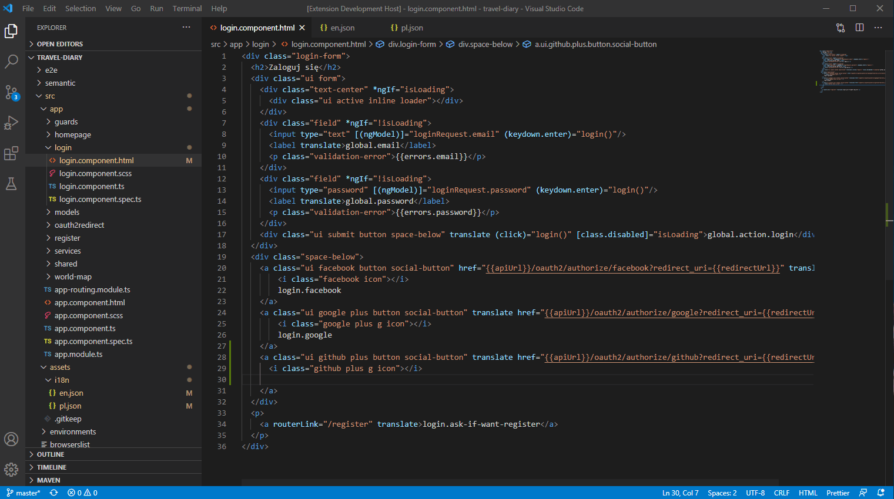

# auto-translator

Auto-translator is an vscode extension which will help You with managing json translation files in your project. With auto-translator you can add new translation key to all supported languages without changing currently opened file.

  

I've decided to create this extension because for me it was annoying to copy-paste every new translation key to multiple files. If You feel lack of some feature in this extension **feel free to open an issue or even contribute :)**

  

## Features

  

Creates translation in all provided translation files.

If you don't want to print Your translation key after adding one, use `create translation` instead of `create translation and print translation key` command.
  

## Extension Settings

  

This extension contributes the following settings:

  

*  `autoTranslatorExt.translationFilePath`: Absolute paths to translation files, if you have more than one translation file separate paths with semicolon.

*  `autoTranslatorExt.endOfLineSymbol`: By default set to \n. Specifies what is your end of line symbol.

  

## Release Notes

  

### 1.0.0

  

First version of auto-translator. :)

  

Added "create translation" and "create translation and print translation key" commands.

  

-----------------------------------------------------------------------------------------------------------

  

### For more information

  

Contact me by email or github :)

  

*  [My website](https://nieruchalski.pl/)

  

**Enjoy!**